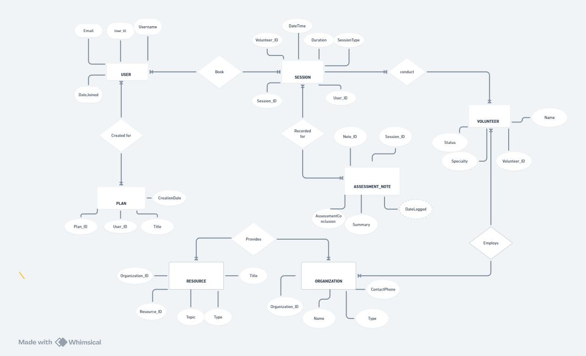

# 🧠 Mental Health Support System 

## 📌 Project Overview
This project is a high-integrity relational database designed to facilitate mental health support services. It manages the complex lifecycle of a user—from initial registration and assessment to professional therapy sessions and long-term wellness plans.

The architecture focuses on **Data Integrity**, **Clinical History Tracking**, and **Scalable Resource Management**.

---

## 🛠️ Technical Architecture
The system is built on **MySQL** and features 9 interconnected tables designed with strict normalization standards.

### Key Features:
* **User Anonymity:** Implemented automatic randomized username generation (`User_RAND`) to protect patient identity.
* **Relational Integrity:** Utilizes `FOREIGN KEY` constraints and `ON DELETE` actions to maintain a clean data web.
* **Domain Logic:** Integration of `CHECK` constraints to enforce business rules (e.g., Volunteer Availability, Session Types, and Severity Levels).
* **Operational Analytics:** A master reporting query that performs 9-table `LEFT JOINs` to provide a 360-degree view of patient progress.

---

## 📂 Schema Breakdown
The database is organized into four core modules:
1.  **User Module:** Manages profiles and personalized wellness plans.
2.  **Volunteer/Org Module:** Tracks specialized volunteers and their affiliations with NGOs, clinics, and hospitals.
3.  **Clinical Module:** Handles scheduling, session durations, and encrypted clinical notes.
4.  **Resource Module:** Connects users to curated mental health tools (Articles, Videos, Podcasts) provided by verified organizations.

---
---

## 🗺️ System Architecture & ERD
The heart of the **Mental Health Support System** is a highly normalized relational schema designed for scalability and data integrity. 

### Entity Relationship Diagram (ERD)
The following diagram illustrates the core entities (Users, Volunteers, Organizations) and the transactional flow of Sessions, Assessments, and Wellness Plans.



### Logic & Relationships:
* **The Session Hub:** The `Sessions` table acts as the central junction, connecting `Users` to `Volunteers` while generating unique links to `Notes` and `Assessments`.
* **Many-to-Many Mapping:** Volunteers are linked to multiple Organizations via the `Volunteer_Organization` associative table, allowing for complex NGO/Clinic affiliations.
* **Clinical History:** `Assessments` and `Notes` are decoupled from the main `Sessions` table to allow for detailed clinical documentation without affecting session-scheduling performance.
* **The Wellness Loop:** `Plans` are directly tied to the `User_ID`, ensuring that even as sessions conclude, the long-term recovery roadmap remains accessible.

---
## 🚀 Getting Started

### Prerequisites
* MySQL Server (v8.0+)
* Any SQL Client (MySQL Workbench, DBeaver, etc.)

### Installation
1. Clone the repository:
   ```bash
   git clone [https://github.com/YOUR_USERNAME/MentalHealthSupportSystem.git](https://github.com/YOUR_USERNAME/MentalHealthSupportSystem.git)
